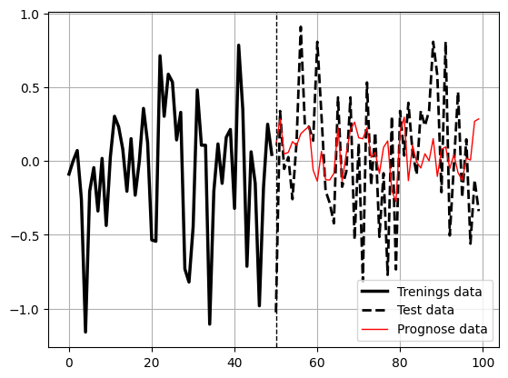

# Bildegjenkjenning Røntgen Lungebetennelse

Syke lunger eller friske lunger?

Teoretisk bakgrunn fra boken "Practical AI for Healthcare Professionals" (Abhinav Suri, 2022)
(Machine Learning with Numpy, Scikit-learn, and TensorFlow)

https://github.com/Apress/Practical-AI-for-Healthcare-Professionals/tree/main

